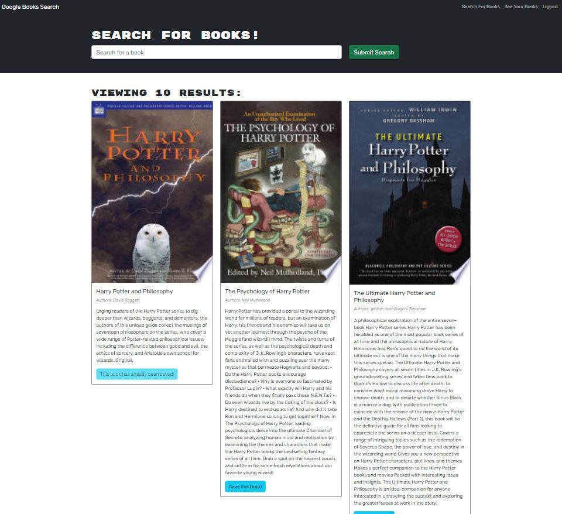
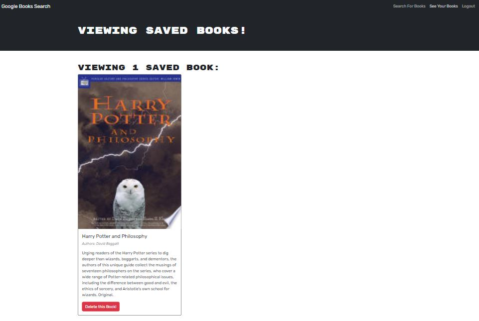

# Book Search Engine 

## Table of Contents
  [Description](#description) 
  [Usage](#usage) 
  [Credits](#credits) 
  [License](#license) 
  [Link to deployed application](#link-to-deployed-application) 
  [Website preview](#website-preview) 
  [Questions](#questions)

## Description
Book Search Engine project is a refactoring project. The objective was to refactor a React web application originally built with a RESTful API to a GraphQL API built with Apollo Server. This app was built using the MERN stack, with a React front end, MongoDB database, and Node.js/Express.js server and API. The app itself is a book search engine that allows users to search books (users will be presented with several search results, each featuring a book’s title, authors, description and image) and save them into their account if they are logged in. 
This project is part of a challenge from Full Stack Coding Bootcamp at the University of Minnesota.

## Usage

1. Open [deployed application](https://bia-jorgensen-book-engine.herokuapp.com/)
1. On the `Search For Books` page, enter a search term in the input field and click the `Submit Search` button
    * You will be presented with several search results; if you wish to save them, you will need to be logged in; if you are logged in, you can select `Save this Book!`
1. If you wish to to access your account or to create one, select `Login/Sign Up`
1. Once you are logged in, you can see your saved books by selecting `See Your Books`
    * You can delete saved books by selecting `Delete this Book!` on this page.
1. Books that are saved into your account will show as `This book has already been saved!` when you search for them again.
1. Select `Logout` to log out of the app.
    * When you log back in, you can still see your saved books (if any) in `See Your Books` 

## Credits

University of Minnesota - Full Stack Coding Bootcamp 
[Lee Klusky](https://github.com/lkalliance) 
[Jamie Barton](https://www.youtube.com/@notrab)
  
[Back to top](#book-search-engine-)

## License

The license for this project is **The MIT License** 
To learn more about this license, please access https://opensource.org/licenses/MIT
  
[Back to top](#book-search-engine-)

## Link to deployed application

https://bia-jorgensen-book-engine.herokuapp.com/
  
[Back to top](#book-search-engine-)

## Website preview

<kbd></kbd> 
<kbd></kbd> 
  
[Back to top](#book-search-engine-)

## Questions
Visit my GitHub profile page: https://github.com/BiaJorgensen 
If you have additional questions, please send an email to souzabeatriz17@gmail.com
  
[Back to top](#book-search-engine-)